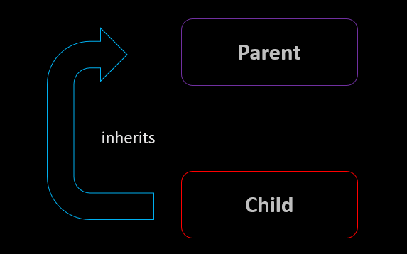

#							Object-Oriented Programming (OOP) Inheritance





Inheritance is a fundamental concept in Object-Oriented Programming (OOP) that allows you to create new classes (child or subclass) based on existing classes (parent or superclass). This concept promotes code reusability and the creation of a hierarchy of classes.

###	       key Terminology

Before we dive deeper into inheritance, let's understand some key terminology:

    Superclass (Parent Class): The existing class from which attributes and methods are inherited. It's often called the "base class" or "parent class."

    Subclass (Child Class): The new class that is created by inheriting attributes and methods from the superclass. It's often called the "derived class" or "child class."

### 	     	    The Inheritance Relationship

Inheritance is represented visually as an "is-a" relationship. This means that a subclass is a specialized version of the superclass. For example:

    If you have a superclass called Vehicle, you can create subclasses like Car and Bicycle. Both Car and Bicycle are types of Vehicle.

###    	   	Benefits of Inheritance

Inheritance offers several advantages in OOP:

    Code Reusability: You can reuse the attributes and methods of the superclass in the subclass, reducing redundant code.

    Hierarchy: It allows you to create a hierarchy of classes, making the code organization more structured and easier to understand.

    Polymorphism: Inheritance is closely related to polymorphism, where objects of different classes can be treated as objects of the superclass.

Example in Python

python

# Superclass (Parent Class)

```

class Vehicle:
    def __init__(self, brand):
        self.brand = brand
```


In this example, the Vehicle class is the superclass, and you can create subclasses like Car and Bicycle to inherit the brand attribute.